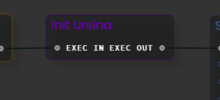
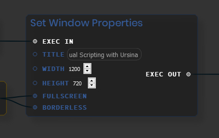
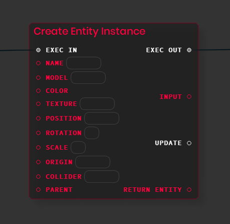
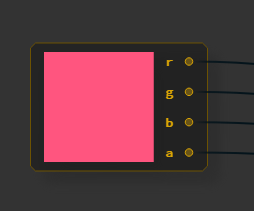
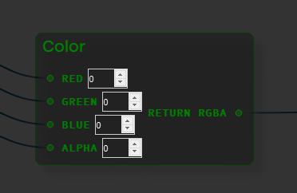
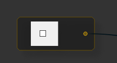
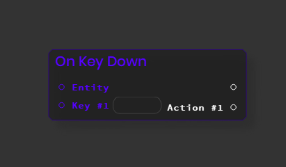
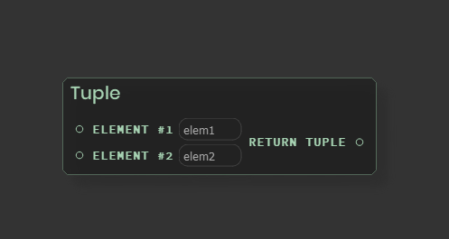

# URSINA - VISUAL SCRIPTING WITH RYVEN

&nbsp;

Implementation of the **[Ursina game engine](https://www.ursinaengine.org/)** in the **[Ryven visual scripting framework](https://ryven.org/)**  for **[Python](https://python.org)**


&nbsp;

## REQUIREMENTS

Before you run the software, make sure that you have these libraries installed

* **matplotlib v3.3.3**
* **numpy v1.19.3**
* **opencv-python v4.4.0.46**
* **PySide2 v5.15.2**
* **scipy v1.5.4**
* **pyowm v3.1.1**
* **ursina (latest)****

See **requirements.txt**.

&nbsp;

## HOW TO RUN

1. Clone the repository using: 

   ````bash
   git clone https://github.com/Someone-github/UrsinaVisualScripting
   ````

2. Navigate to UrsinaVisualScripting/Ryven using:

   ````bash
   cd UrsinaVisualScripting/Ryven
   ````

3. Run Ryven.py using:

   ````bash
   python Ryven.py
   ````

&nbsp;

## GET STARTED

Here are all the available nodes that were added to **Ryven**:

1. **Init Ursina**: this node will initialize the Ursina engine

   

   &nbsp;

2. **Set Window Properties**: this node adds the possibility to customize the window

   

   &nbsp;

3. **Create Entity Instance**: this will create a new entity with the collected input values

   

   &nbsp;

4. **Color Picker**: this allows you to choose a color and get it's **R** value, **G** value and **B** value

   
   
   &nbsp;
   
5. **Color**: this node collects the RGBA values of the color picker and converts the values to **ursina.color.rgba**

   
   
   &nbsp;
   
6. **CheckBox**: returns boolean value

   

   &nbsp;

7. **On Key Down**: binds an event to a key in the keyboard

   

   &nbsp;

8. **Tuple** Create tuple variables using this node

   

&nbsp;

## WARNING!

This project is still under development, but you can still test it by downloading the source and running it


